Studying Rational Agency and Epistemic Communities with Large Language
Models:<br/> Review, How-To, and Reflection
================
Gregor Betz (DebateLab@KIT)

# Review

## Autonomous LLM-based in Agents

<div class="r-stack">

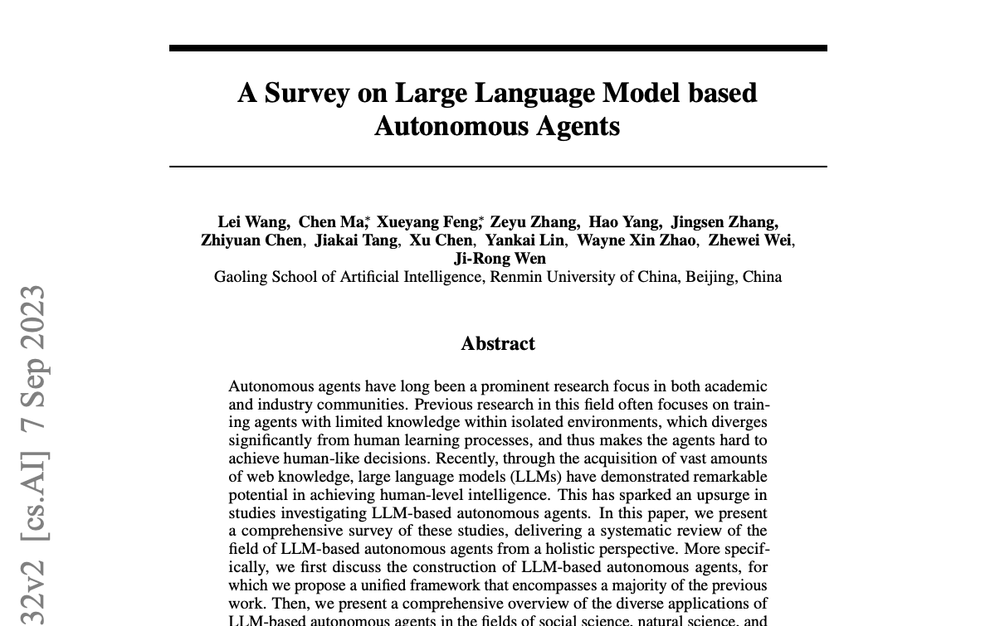


</div>

<div class="div" style="text-align: right; font-size: 0.7em;">

📄 Wang et al. (2023)

</div>

<div class="notes">

Let me first point you to this recent review of LLM-based agents.

More and more highly diverse agents build with LLMs (CoT, ToolFormer)

Blue boxes: Groups of agents that communicate in NL and internally plan
and act by generating NL texts

</div>

## Artificial Deliberating Agents

<div class="r-stack">


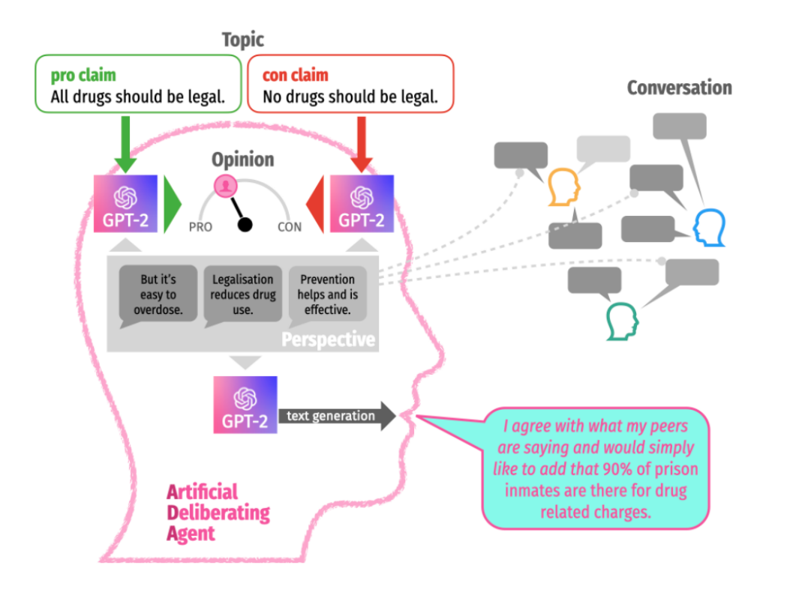

</div>

<div class="div" style="text-align: right; font-size: 0.7em;">

📄 Betz (2022)

</div>

<div class="notes">

Three years ago, I used LLM-based agents to probe the Mäs-Flache model
of argumentative opinion dynamics.

In this model, agents are exchanging reasons that form the basis of
their individual beliefs. With LLMs we can build agents that can
directly process English sentence (pros and cons in debate), rather than
their abstract symbolic representation.

The main findings are: 1. Confirmation: NL models can reproduce basic
dynamics of sybolic models 2. Limitations: Allowing agents to generate
new reasons (rather than simply exchanging given ones) changes dynamics
profoundly

</div>

## “Debating” LLMs

<div class="r-stack">

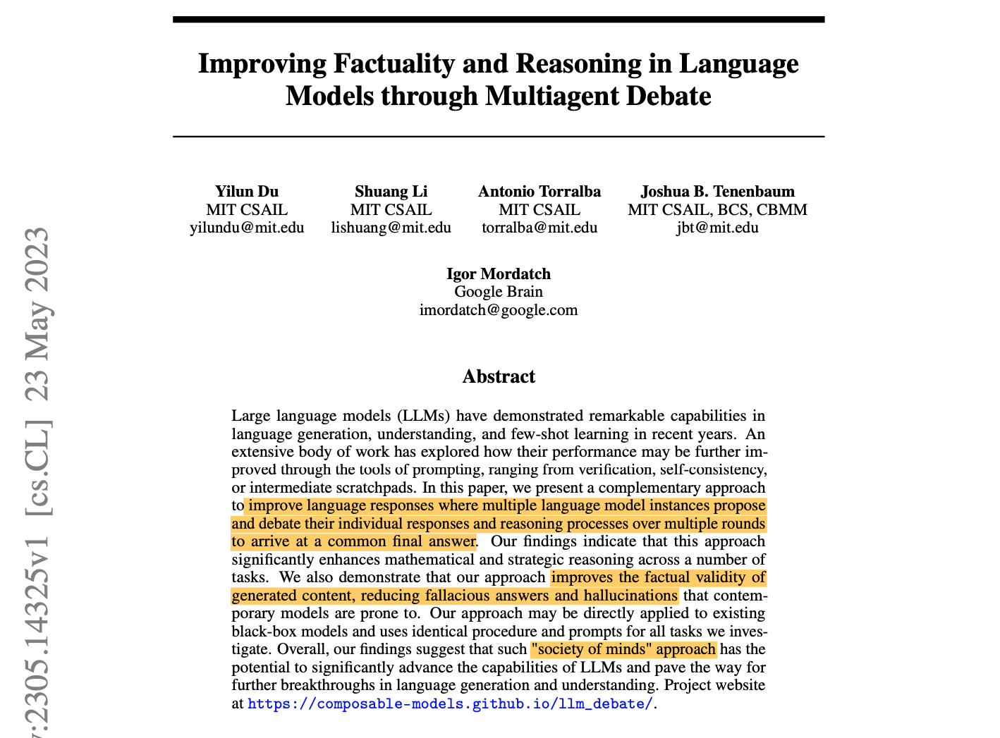

</div>

<div class="div" style="text-align: right; font-size: 0.7em;">

📄 Du et al. (2023)

</div>

## “Debating” LLMs

**Prompt:** “These are the solutions to the problem from other agents:
\<*other agent responses*\> Using the reasoning from other agents as
additional advice, can you give an updated answer? Examine your solution
and that other agents. Put your answer in the form (X) at the end of
your response.”

<div class="r-stack">

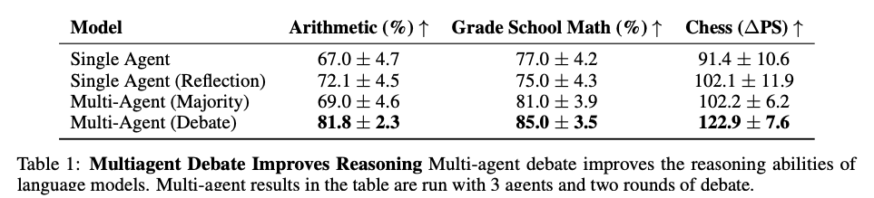

</div>

<div class="div fragment" style="text-align: right;" fragment-index="1">

📄 Du et al. (2023)

</div>

# How-To

## Code Boilerplate

<div class="r-stack">

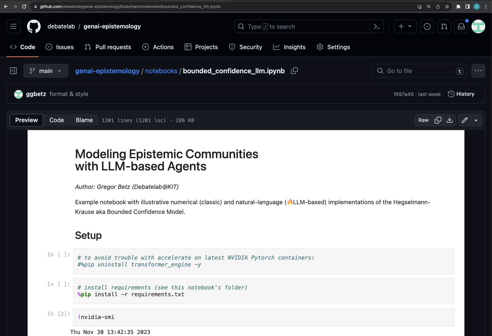

</div>

<https://github.com/debatelab/genai-epistemology>

## Skeleton Bounded Confidence Agent

``` python
class AbstractBCAgent():

    def update(self, community):
        opinions = [peer.opinion for peer in self.peers(community)]
        self.opinion = self.revise(opinions)

    def peers(self, community):
        peers = [
            agent for agent in community
            if self.distance(agent.opinion) <= epsilon
        ]
        return peers

    def distance(self, opinion):
        pass 

    def revise(self, opinions):
        pass
```

## Numerical BC Agent

``` python
class NumericalBCAgent(AbstractBCAgent):

    def distance(self, opinion):
        """calculates distance between agent's and other opinion"""
        return abs(opinion - self.opinion)

    def revise(self, opinions):
        """revision through weighted opinion averaging"""
        alpha = self._parameters.get("alpha", .5)
        revision = alpha * self.opinion + (1-alpha) * np.mean(opinions)
        return revision
```

## Numerical BC Model: Results

<div class="r-stack r-stretch">

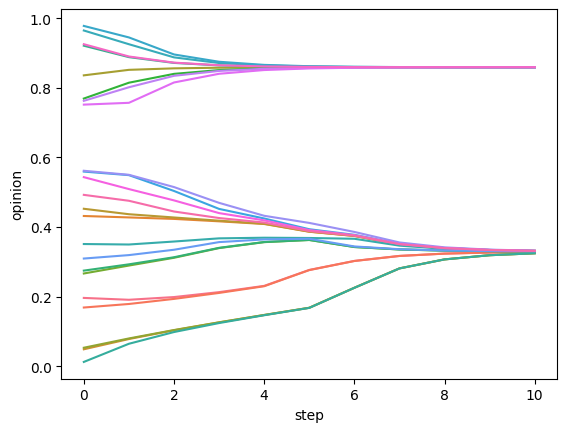

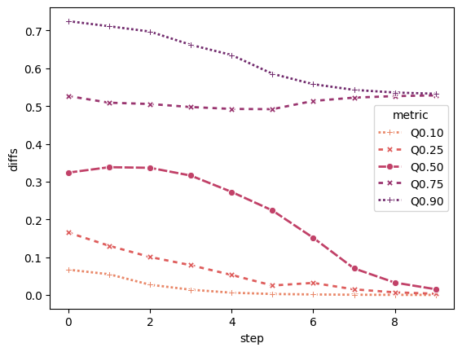

</div>

## Numerical BC Agent

``` python
class NumericalBCAgent(AbstractBCAgent):

    def distance(self, opinion):
        """calculates distance between agent's and other opinion"""
        return abs(opinion - self.opinion)

    def revise(self, opinions):
        """revision through weighted opinion averaging"""
        alpha = self._parameters.get("alpha", .5)
        revision = alpha * self.opinion + (1-alpha) * np.mean(opinions)
        return revision
```

## Large Language Model

``` python
model = lmql.model(
    "local:HuggingFaceH4/zephyr-7b-alpha",
    device_map = "auto",
    load_in_8bit=True,
    low_cpu_mem_usage=True
)
```

## Agreement Prompt

<div class="r-stack">

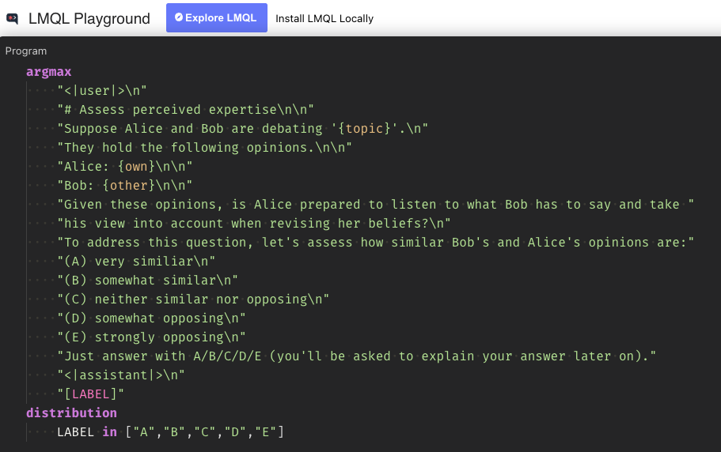

</div>

## Revision Prompt

<div class="r-stack">

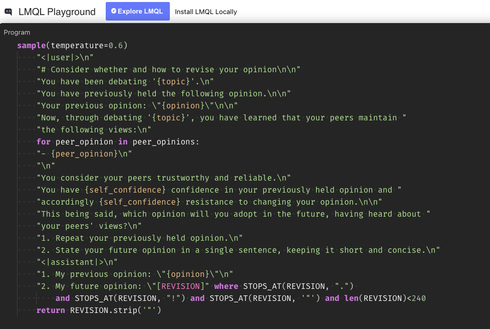

</div>

## Natural Language BC Agent

``` python
class NaturalLanguageBCAgent(AbstractBCAgent):

    def distance(self, other):
        """distance as expected agreement level"""
        lmql_result = agreement_lmq(
            self.opinion, other, **kwargs
        )
        probs = lmql_result.variables.get("P(LABEL)")
        return sum([i*v for i, (_, v) in enumerate(probs)])/4.0

    def revise(self, peer_opinions):
        """natural language opinion revision"""
        revision = revise_lmq(
            self.opinion, peer_opinions, **kwargs
        )
        return revision
```

## Natural Language BC Model: Results

`alpha`=“very high”; `epsilon`=<span class="fragment strike"
fragment-index="2">**0.4**</span><span class="fragment fade-in"
fragment-index="2">**0.5**</span>; `topic`=“veganism”

<div class="r-stack r-stretch">

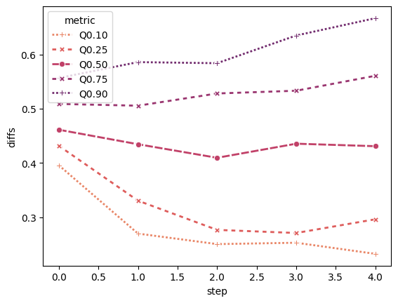

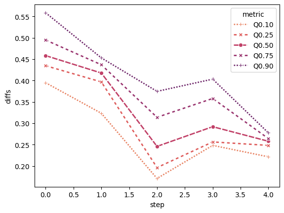

</div>

# Reflection

## Why LLM-based ABMs?

<div class="incremental">

1.  Re-create and probe our epistemological (computational) models.
2.  Simulate and test scientific methodologies, reasoning modes,
    principles of rationality.  
    <span class="fragment">**Any!**</span> <span class="fragment">(E.g.
    value-free ideal.)</span>  
    <span class="fragment">Without formalizing them.</span>

</div>

<div class="fragment">

🤔 Are LLMs suited for building epistemic agents?

</div>

## 🤔 LLMs’ abilities: Reasoning? (1/3)

<div class="r-stack">

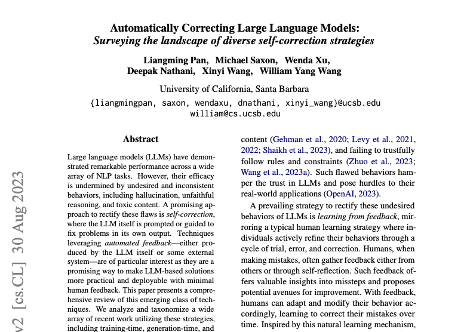

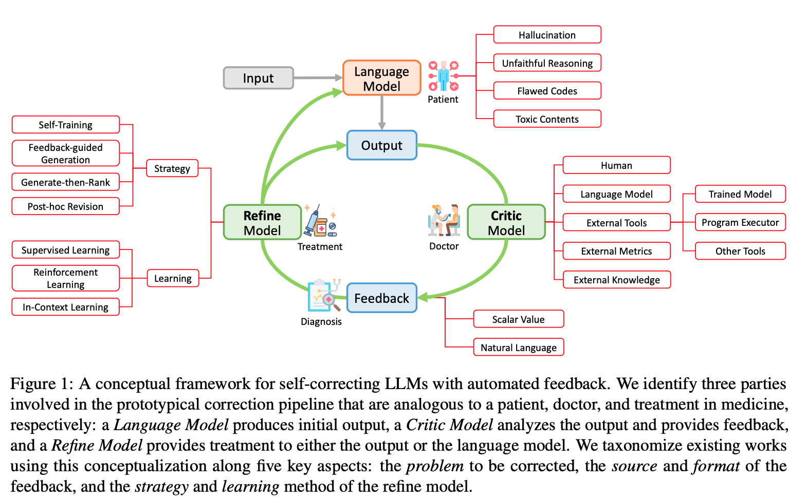

</div>

<div class="div" style="text-align: right; font-size: 0.7em;">

📄 Pan et al. (2023)

</div>

## 🤔 LLMs’ abilities: Reasoning? (2/3)

<div class="r-stack">

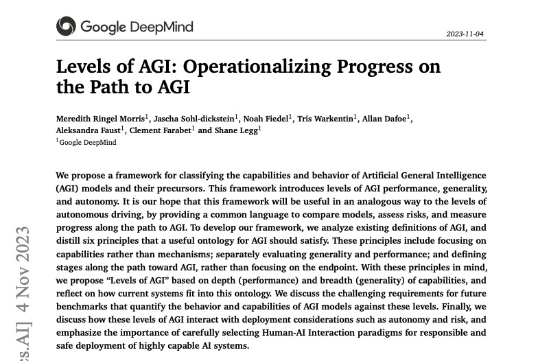

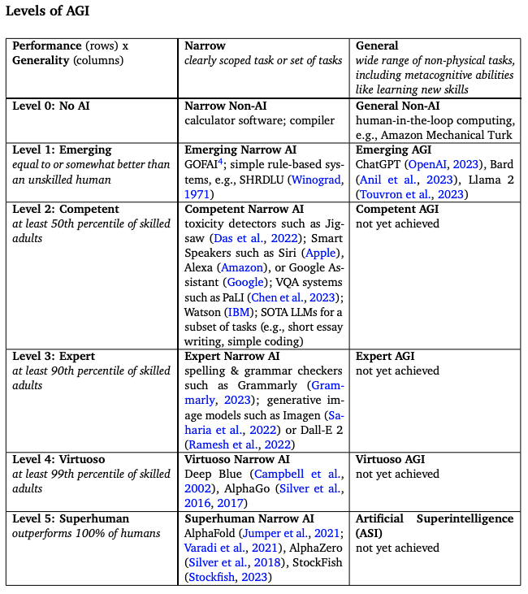

</div>

<div class="div" style="text-align: right; font-size: 0.7em;">

📄 Morris et al. (2023)

</div>

## 🤔 LLMs’ abilities: Reasoning? (3/3)

<div class="r-stack">

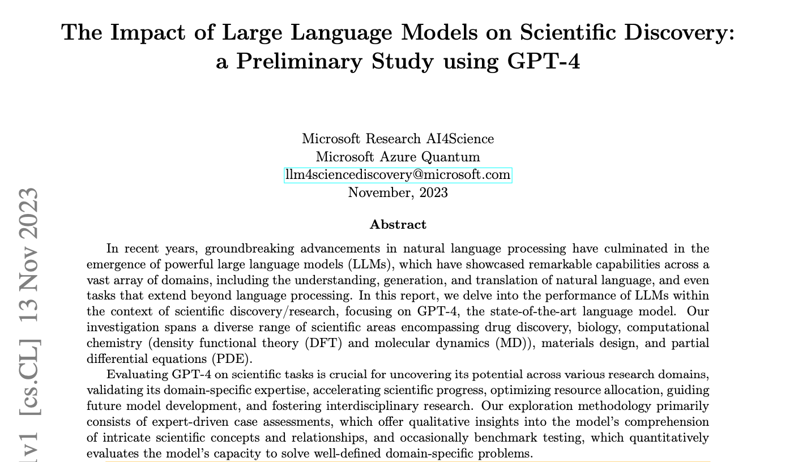

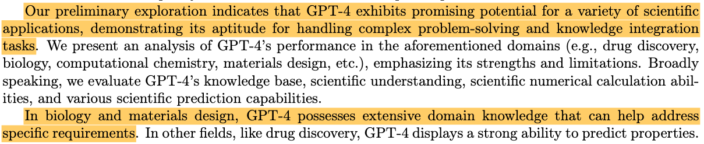

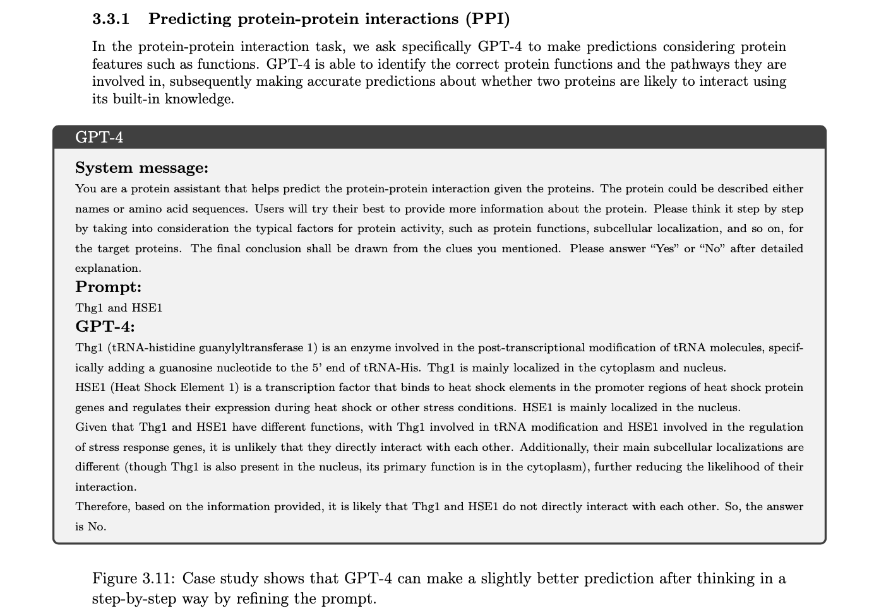

</div>

<div class="div" style="text-align: right; font-size: 0.7em;">

📄 AI4Science and Quantum (2023)

</div>

## 🤔 LLMs’ abilities: Beliefs?

<div class="r-stack">

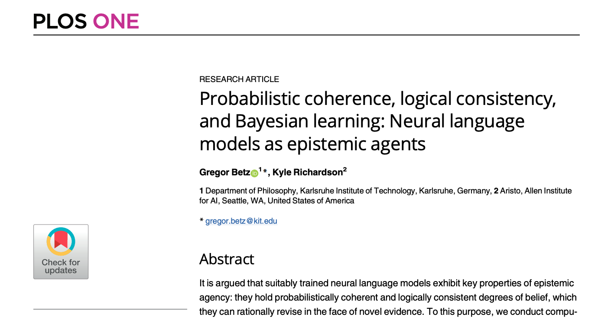

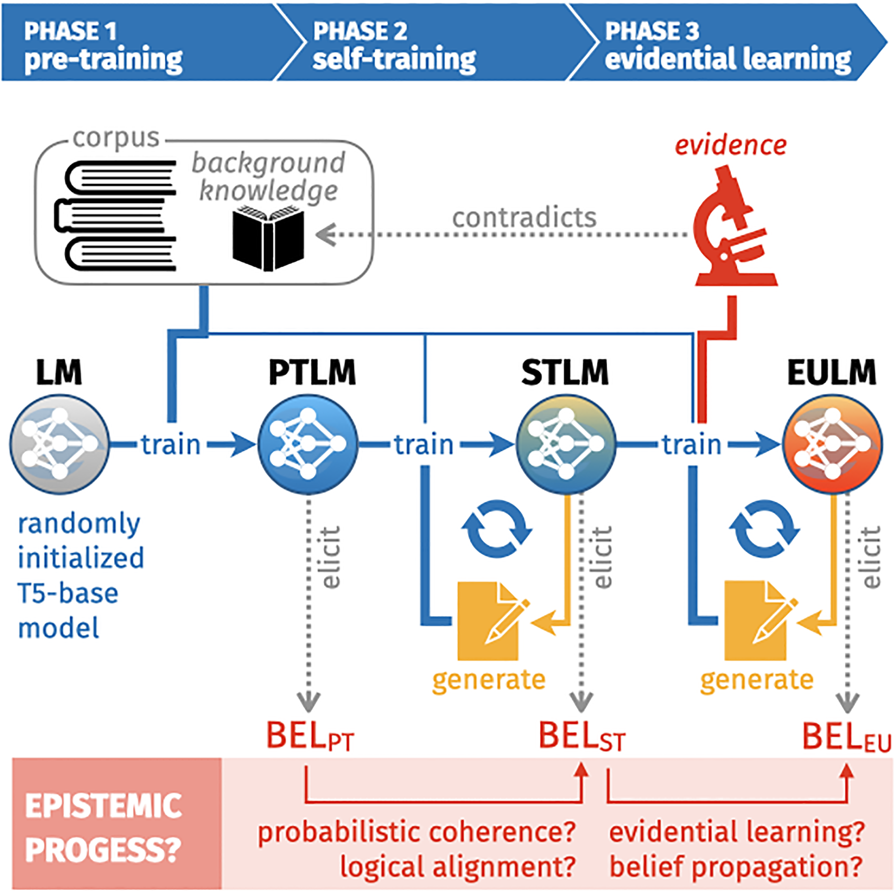

</div>

<div class="div" style="text-align: right; font-size: 0.7em;">

📄 Betz and Richardson (2023)

</div>

## 🤔 LLMs’ abilities: Unhuman?

But humans’ cognitive architecture is fundamentally different from LLMs’
<span class="fragment">, or is it?</span>

<div class="r-stack">

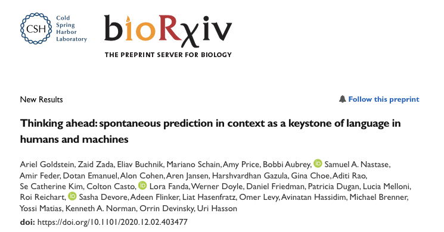

</div>

<div class="div" style="text-align: right; font-size: 0.7em;">

📄 Goldstein et al. (2020)

</div>

## 🤔 LLMs’ abilities: Unhuman?

📄 The neural architecture of language: Integrative modeling converges
on predictive processing. (Schrimpf et al. 2021)

<div class="div" style="font-size: 0.8em;">

TLDR It is found that the most powerful “transformer” models predict
nearly 100% of explainable variance in neural responses to sentences and
generalize across different datasets and imaging modalities \[…\].

</div>

📄 Brains and algorithms partially converge in natural language
processing. (Caucheteux and King 2022)

<div class="div" style="font-size: 0.8em;">

TLDR This study shows that modern language algorithms partially converge
towards brain-like solutions, and thus delineates a promising path to
unravel the foundations of natural language processing.

</div>

📄 Mapping Brains with Language Models: A Survey. (Karamolegkou, Abdou,
and Søgaard 2023)

<div class="div" style="font-size: 0.8em;">

ABSTRACT \[…\] We also find that the accumulated evidence, for now,
remains ambiguous, but correlations with model size and quality provide
grounds for cautious optimism.

</div>

📄 Artificial neural network language models predict human brain
responses to language even after a developmentally realistic amount of
training. (Hosseini et al. 2022)

<div class="div" style="font-size: 0.8em;">

TLDR \[A\] developmentally realistic amount of training may suffice and
\[…\] models that have received enough training to achieve sufficiently
high next-word prediction performance also acquire representations of
sentences that are predictive of human fMRI responses.

</div>

## Conclusion

LLMs suited for building epistemic agents?

<div class="incremental">

- ✅ reasoning skill
- ✅ consistent belief states (syn- and diachronic)
- ✅ similarities to human cognition

</div>

<span class="r-fit-text fragment">Come, join the party! 🎉</span>

## Conclusion

Vanishing distinctions (due to AGI):

<div class="incremental">

- simulating science *vs* doing science
- epistemology *vs* AI

</div>

## Conclusion

Epistemic redundancy (due to AGI) brings profound philosophical
challenges:

<div class="incremental">

- What role for humans in science? University?
- Science in a democracy? AGI-proof well-ordered science?
- If AGI is science’s ultimate “Freudian” offence and blow to humans’
  collective narcissism, which revisions of our self-conception (as
  rational & moral persons) may avoid existentialist disaster? AGI-proof
  humanism?

</div>

# Backup

## References

<div id="refs" class="references csl-bib-body hanging-indent">

<div id="ref-ai4science2023impact" class="csl-entry">

AI4Science, Microsoft Research, and Microsoft Azure Quantum. 2023. “The
Impact of Large Language Models on Scientific Discovery: A Preliminary
Study Using GPT-4.” <https://arxiv.org/abs/2311.07361>.

</div>

<div id="ref-betz2022" class="csl-entry">

Betz, Gregor. 2022. “Natural-Language Multi-Agent Simulations of
Argumentative Opinion Dynamics.” *Journal of Artificial Societies and
Social Simulation* 25 (1): 2. <https://doi.org/10.18564/jasss.4725>.

</div>

<div id="ref-BetzRichardson2023" class="csl-entry">

Betz, Gregor, and Kyle Richardson. 2023. “Probabilistic Coherence,
Logical Consistency, and Bayesian Learning: Neural Language Models as
Epistemic Agents.” *PLOS ONE* 18 (2): 1–29.
<https://doi.org/10.1371/journal.pone.0281372>.

</div>

<div id="ref-caucheteux2022brains" class="csl-entry">

Caucheteux, Charlotte, and Jean-Rémi King. 2022. “Brains and Algorithms
Partially Converge in Natural Language Processing.” *Communications
Biology* 5 (1): 134.

</div>

<div id="ref-du2023improving" class="csl-entry">

Du, Yilun, Shuang Li, Antonio Torralba, Joshua B. Tenenbaum, and Igor
Mordatch. 2023. “Improving Factuality and Reasoning in Language Models
Through Multiagent Debate.” <https://arxiv.org/abs/2305.14325>.

</div>

<div id="ref-Goldstein2020ThinkingAS" class="csl-entry">

Goldstein, Ariel, Zaid Zada, Eliav Buchnik, Mariano Schain, Amy Rose
Price, Bobbi Aubrey, Samuel A. Nastase, et al. 2020. “Thinking Ahead:
Spontaneous Prediction in Context as a Keystone of Language in Humans
and Machines.” *bioRxiv*.
<https://api.semanticscholar.org/CorpusID:227915127>.

</div>

<div id="ref-hosseini2022artificial" class="csl-entry">

Hosseini, Eghbal A, Martin Schrimpf, Yian Zhang, Samuel Bowman, Noga
Zaslavsky, and Evelina Fedorenko. 2022. “Artificial Neural Network
Language Models Align Neurally and Behaviorally with Humans Even After a
Developmentally Realistic Amount of Training.” *BioRxiv*, 2022–10.

</div>

<div id="ref-karamolegkou2023mapping" class="csl-entry">

Karamolegkou, Antonia, Mostafa Abdou, and Anders Søgaard. 2023. “Mapping
Brains with Language Models: A Survey.” *arXiv Preprint
arXiv:2306.05126*.

</div>

<div id="ref-morris2023levels" class="csl-entry">

Morris, Meredith Ringel, Jascha Sohl-dickstein, Noah Fiedel, Tris
Warkentin, Allan Dafoe, Aleksandra Faust, Clement Farabet, and Shane
Legg. 2023. “Levels of AGI: Operationalizing Progress on the Path to
AGI.” <https://arxiv.org/abs/2311.02462>.

</div>

<div id="ref-pan2023automatically" class="csl-entry">

Pan, Liangming, Michael Saxon, Wenda Xu, Deepak Nathani, Xinyi Wang, and
William Yang Wang. 2023. “Automatically Correcting Large Language
Models: Surveying the Landscape of Diverse Self-Correction Strategies.”
<https://arxiv.org/abs/2308.03188>.

</div>

<div id="ref-doi:10.1073/pnas.2105646118" class="csl-entry">

Schrimpf, Martin, Idan Asher Blank, Greta Tuckute, Carina Kauf, Eghbal
A. Hosseini, Nancy Kanwisher, Joshua B. Tenenbaum, and Evelina
Fedorenko. 2021. “The Neural Architecture of Language: Integrative
Modeling Converges on Predictive Processing.” *Proceedings of the
National Academy of Sciences* 118 (45): e2105646118.
<https://doi.org/10.1073/pnas.2105646118>.

</div>

<div id="ref-wang2023survey" class="csl-entry">

Wang, Lei, Chen Ma, Xueyang Feng, Zeyu Zhang, Hao Yang, Jingsen Zhang,
Zhiyuan Chen, et al. 2023. “A Survey on Large Language Model Based
Autonomous Agents.” <https://arxiv.org/abs/2308.11432>.

</div>

</div>
